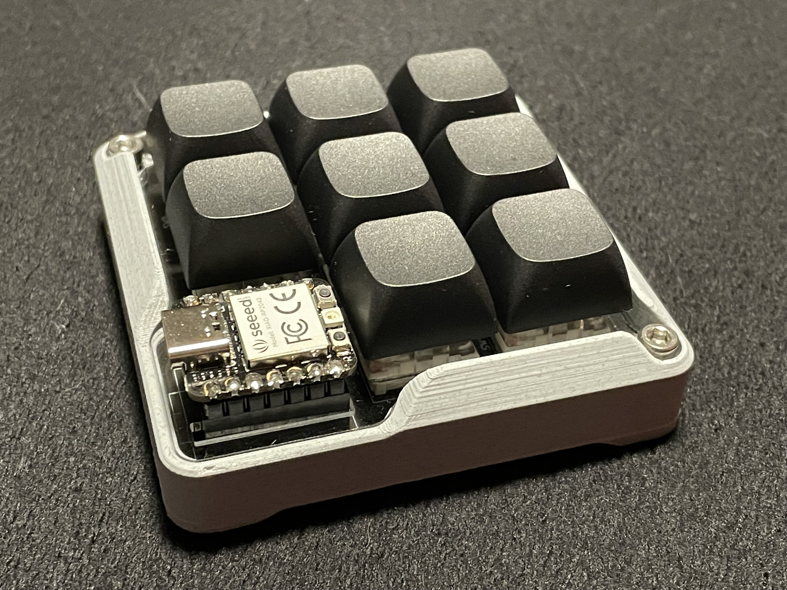

# circuitpython_macropad
### Details for a Hand-Built Macropad (and its Background Code)
##### *All plans and files originally from University of Alberta's ELKO Engineering Garage*
##### *Controller Software was Partially Developed by Myself, all other Code is Not my own work.*

# Overview
Deatils (Ideas)

# Building the Macropad
Deatils (steps)

### Files
Deatils (links)
